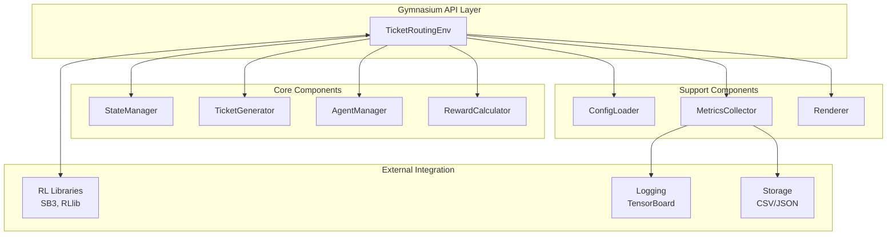
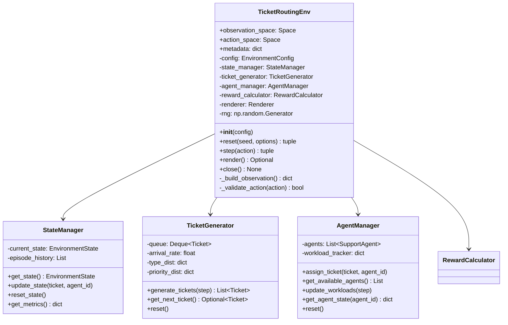
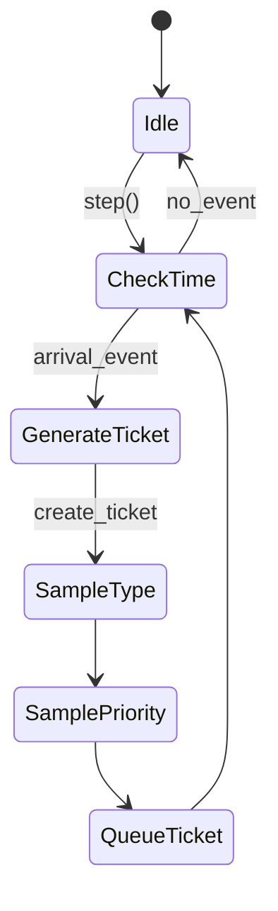
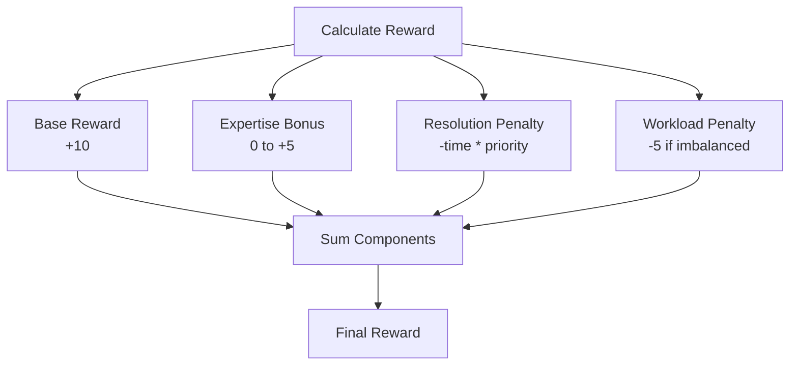
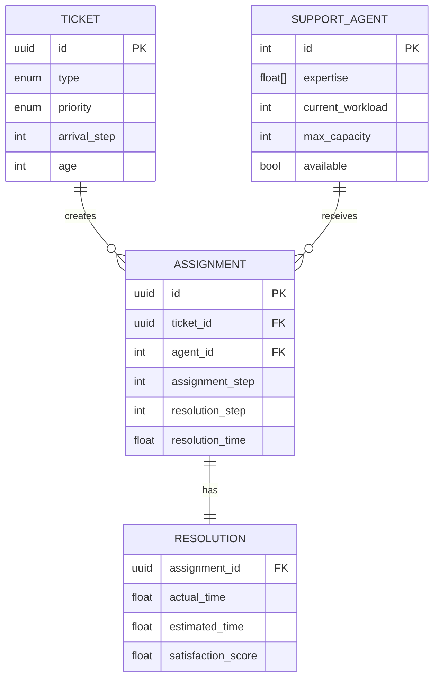

# Technical Design Document: Support Ticket Routing RL Environment

## Architecture Overview

The Support Ticket Routing RL Environment follows a modular architecture implementing the Gymnasium API standard. The system is designed as a discrete-event simulation with pluggable components for ticket generation, agent management, reward calculation, and visualization.

### High-Level Architecture



### Design Principles

1. **Separation of Concerns**: Each component has a single, well-defined responsibility
2. **Strategy Pattern**: Pluggable reward functions and ticket generation strategies
3. **Observer Pattern**: Metrics collection without tight coupling
4. **Dependency Injection**: Configuration-driven component initialization
5. **Type Safety**: Full type hints for all public interfaces

## Component Design

### 1. TicketRoutingEnv (Main Environment)

**Responsibility**: Implements Gymnasium API and orchestrates all components

**Class Structure**:


**Key Methods**:

```python
def reset(self, seed: Optional[int] = None, options: Optional[dict] = None) -> Tuple[dict, dict]:
    """Reset environment to initial state."""
    super().reset(seed=seed)
    self.rng = np.random.default_rng(seed)
    
    # Reset all components
    self.state_manager.reset_state()
    self.ticket_generator.reset()
    self.agent_manager.reset()
    
    # Generate initial tickets
    initial_tickets = self.ticket_generator.generate_tickets(0)
    
    observation = self._build_observation()
    info = {"queue_size": len(initial_tickets)}
    
    return observation, info

def step(self, action: int) -> Tuple[dict, float, bool, bool, dict]:
    """Execute one environment step."""
    # Validate action
    if not self._validate_action(action):
        raise ValueError(f"Invalid action: {action}")
    
    # Get current ticket and assign to agent
    ticket = self.ticket_generator.get_next_ticket()
    self.agent_manager.assign_ticket(ticket, action)
    
    # Update state
    self.state_manager.update_state(ticket, action)
    
    # Generate new tickets
    new_tickets = self.ticket_generator.generate_tickets(self.state_manager.step)
    
    # Calculate reward
    reward = self.reward_calculator.calculate(ticket, action, self.agent_manager)
    
    # Check termination
    terminated = self.state_manager.step >= self.config.episode_length
    truncated = False
    
    # Build observation
    observation = self._build_observation()
    info = self.state_manager.get_metrics()
    
    return observation, reward, terminated, truncated, info
```

### 2. StateManager

**Responsibility**: Maintains environment state and episode metrics

**State Representation**:
```python
@dataclass
class EnvironmentState:
    step: int
    tickets_processed: int
    total_resolution_time: float
    agent_workloads: np.ndarray  # shape: (num_agents,)
    current_ticket: Optional[Ticket]
    queue: Deque[Ticket]
    active_assignments: Dict[int, List[Assignment]]  # agent_id -> list of assignments
```

### 3. TicketGenerator

**Responsibility**: Generates tickets based on configurable distributions

**Ticket Generation Strategy**:


**Implementation**:
```python
class TicketGenerator:
    def __init__(self, config: TicketConfig, rng: np.random.Generator):
        self.arrival_rate = config.arrival_rate  # tickets per day
        self.type_distribution = config.type_distribution
        self.priority_distribution = config.priority_distribution
        self.queue = deque()
        self.rng = rng
        self.step = 0
    
    def generate_tickets(self, current_step: int) -> List[Ticket]:
        """Generate tickets using Poisson process."""
        # Calculate arrivals based on time elapsed
        time_delta = (current_step - self.step) / 1000.0  # steps to days
        expected_arrivals = self.arrival_rate * time_delta
        num_arrivals = self.rng.poisson(expected_arrivals)
        
        tickets = []
        for _ in range(num_arrivals):
            ticket = self._create_ticket(current_step)
            tickets.append(ticket)
            self.queue.append(ticket)
        
        self.step = current_step
        return tickets
    
    def _create_ticket(self, arrival_step: int) -> Ticket:
        """Create a single ticket with sampled attributes."""
        ticket_type = self.rng.choice(
            list(TicketType), 
            p=list(self.type_distribution.values())
        )
        priority = self.rng.choice(
            list(Priority), 
            p=list(self.priority_distribution.values())
        )
        
        return Ticket(
            id=uuid.uuid4(),
            type=ticket_type,
            priority=priority,
            arrival_step=arrival_step
        )
```

### 4. AgentManager

**Responsibility**: Manages support agents and tracks workloads

**Agent Model**:
```python
@dataclass
class SupportAgent:
    id: int
    expertise: np.ndarray  # shape: (num_ticket_types,), values in [0, 1]
    current_workload: int
    max_capacity: int = 10
    
    def is_available(self) -> bool:
        return self.current_workload < self.max_capacity
    
    def get_resolution_time(self, ticket_type: TicketType) -> float:
        """Calculate expected resolution time for ticket type."""
        base_time = 24.0  # hours
        expertise_factor = self.expertise[ticket_type.value]
        # Higher expertise -> faster resolution
        time_multiplier = 2.0 - expertise_factor
        return base_time * time_multiplier
```

### 5. RewardCalculator

**Responsibility**: Computes reward signals for RL agent

**Reward Function Design**:


**Implementation**:
```python
class RewardCalculator:
    def __init__(self, config: RewardConfig):
        self.base_reward = config.base_reward
        self.priority_multipliers = {
            Priority.CRITICAL: 4.0,
            Priority.HIGH: 2.0,
            Priority.MEDIUM: 1.0,
            Priority.LOW: 0.5
        }
        self.workload_threshold = config.workload_threshold
        self.workload_penalty = config.workload_penalty
    
    def calculate(self, ticket: Ticket, agent_id: int, 
                  agent_manager: AgentManager) -> float:
        """Calculate reward for assignment decision."""
        agent = agent_manager.get_agent(agent_id)
        
        # Base reward for valid assignment
        reward = self.base_reward
        
        # Expertise bonus
        expertise_score = agent.expertise[ticket.type.value]
        expertise_bonus = expertise_score * 5.0
        reward += expertise_bonus
        
        # Resolution time penalty (estimated)
        resolution_time = agent.get_resolution_time(ticket.type)
        priority_mult = self.priority_multipliers[ticket.priority]
        resolution_penalty = resolution_time * priority_mult * 0.1
        reward -= resolution_penalty
        
        # Workload balance penalty
        workload_std = np.std(agent_manager.get_workloads())
        if workload_std > self.workload_threshold:
            reward -= self.workload_penalty
        
        return reward
```

## Data Models

### Core Entities



### Enumerations

```python
class TicketType(IntEnum):
    TECHNICAL = 0
    BILLING = 1
    FEATURE = 2
    BUG = 3
    INTEGRATION = 4

class Priority(IntEnum):
    CRITICAL = 0
    HIGH = 1
    MEDIUM = 2
    LOW = 3
```

## API Design

### Gymnasium API Compliance

```python
# Observation Space
observation_space = gym.spaces.Dict({
    'current_ticket': gym.spaces.Dict({
        'type': gym.spaces.Discrete(5),
        'priority': gym.spaces.Discrete(4),
        'age': gym.spaces.Box(low=0, high=np.inf, shape=(1,), dtype=np.float32)
    }),
    'agents': gym.spaces.Dict({
        'expertise': gym.spaces.Box(low=0, high=1, shape=(num_agents, 5), dtype=np.float32),
        'workload': gym.spaces.Box(low=0, high=10, shape=(num_agents,), dtype=np.int32),
        'availability': gym.spaces.MultiBinary(num_agents)
    }),
    'queue_size': gym.spaces.Discrete(100),
    'time_step': gym.spaces.Discrete(1000)
})

# Action Space
action_space = gym.spaces.Discrete(num_agents)
```

### Configuration API

```python
@dataclass
class EnvironmentConfig:
    num_agents: int = 5
    episode_length: int = 1000
    max_queue_size: int = 50
    ticket_config: TicketConfig = field(default_factory=TicketConfig)
    reward_config: RewardConfig = field(default_factory=RewardConfig)
    agent_config: AgentConfig = field(default_factory=AgentConfig)
    
    @classmethod
    def from_yaml(cls, path: str) -> 'EnvironmentConfig':
        """Load configuration from YAML file."""
        with open(path) as f:
            data = yaml.safe_load(f)
        return cls(**data)
```

## Integration Points

### RL Library Integration

```python
# Stable Baselines3 Integration
from stable_baselines3 import PPO
from stable_baselines3.common.env_checker import check_env

env = TicketRoutingEnv(config)
check_env(env)  # Validate Gymnasium compliance

model = PPO("MultiInputPolicy", env, verbose=1)
model.learn(total_timesteps=100_000)
```

### Vectorized Environments

```python
from gymnasium.vector import AsyncVectorEnv

def make_env(rank: int):
    def _init():
        env = TicketRoutingEnv(config)
        env.reset(seed=42 + rank)
        return env
    return _init

# Create 4 parallel environments
vec_env = AsyncVectorEnv([make_env(i) for i in range(4)])
```

### Logging Integration

```python
class MetricsCollector:
    def __init__(self, log_dir: str):
        self.writer = SummaryWriter(log_dir)
        self.episode_rewards = []
        self.episode_lengths = []
    
    def log_step(self, reward: float, info: dict):
        """Log step-level metrics."""
        self.writer.add_scalar('reward/step', reward, info['step'])
    
    def log_episode(self, episode: int, metrics: dict):
        """Log episode-level metrics."""
        self.writer.add_scalar('metrics/avg_resolution_time', 
                              metrics['avg_resolution_time'], episode)
        self.writer.add_scalar('metrics/agent_utilization',
                              metrics['agent_utilization'], episode)
```

## Performance Considerations

### Optimization Strategies

1. **Vectorized Operations**: Use NumPy arrays for agent states and expertise matrices
2. **Efficient Queue**: Use `collections.deque` for O(1) append/pop operations
3. **Lazy Evaluation**: Only compute metrics when requested
4. **Memory Pooling**: Reuse ticket objects to reduce allocation overhead

### Performance Targets

```python
# Profiling decorator
def profile_step(func):
    def wrapper(*args, **kwargs):
        start = time.perf_counter()
        result = func(*args, **kwargs)
        elapsed = time.perf_counter() - start
        if elapsed > 0.001:  # 1ms threshold
            logger.warning(f"Step took {elapsed*1000:.2f}ms")
        return result
    return wrapper
```

## Error Handling

### Validation Strategy

```python
class TicketRoutingEnv:
    def _validate_action(self, action: int) -> bool:
        """Validate action is within bounds and agent is available."""
        if not (0 <= action < self.config.num_agents):
            raise ValueError(f"Action {action} out of range [0, {self.config.num_agents})")
        
        agent = self.agent_manager.get_agent(action)
        if not agent.is_available():
            raise ValueError(f"Agent {action} at capacity ({agent.current_workload}/{agent.max_capacity})")
        
        return True
    
    def _validate_observation(self, obs: dict) -> bool:
        """Validate observation matches declared space."""
        return self.observation_space.contains(obs)
```

### Error Recovery

- **Invalid Actions**: Raise `ValueError` with descriptive message
- **State Corruption**: Log error and reset environment
- **Configuration Errors**: Validate at initialization, fail fast
- **Numerical Stability**: Clip rewards and normalize observations

---

**Document Version**: 1.0  
**Last Updated**: 2025-11-14  
**Status**: Ready for Implementation
