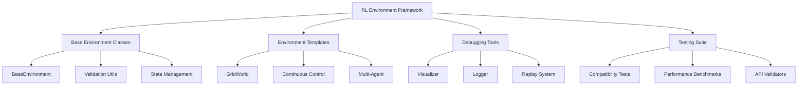
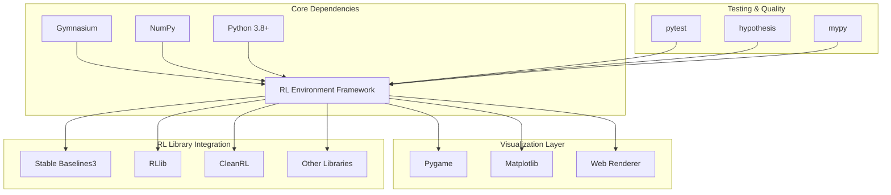
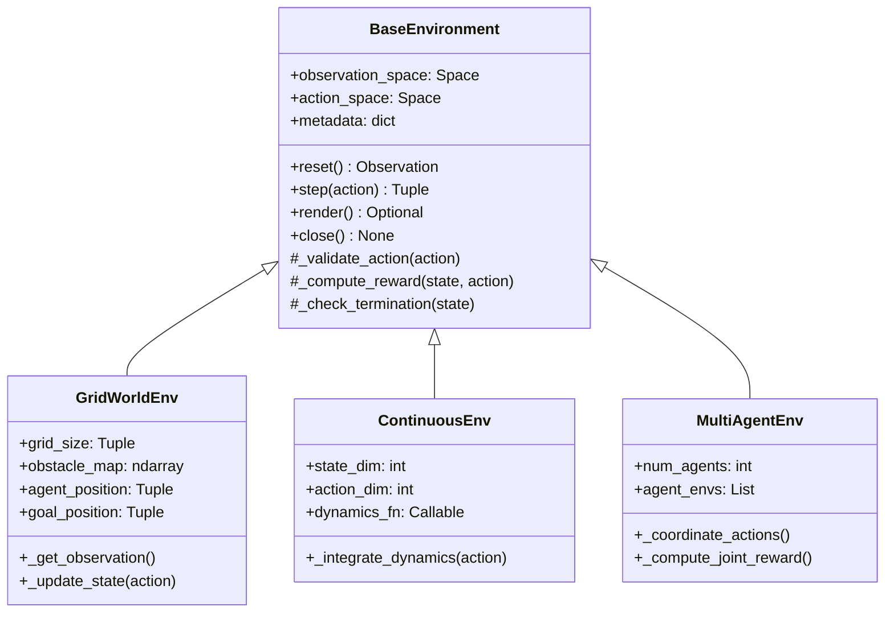
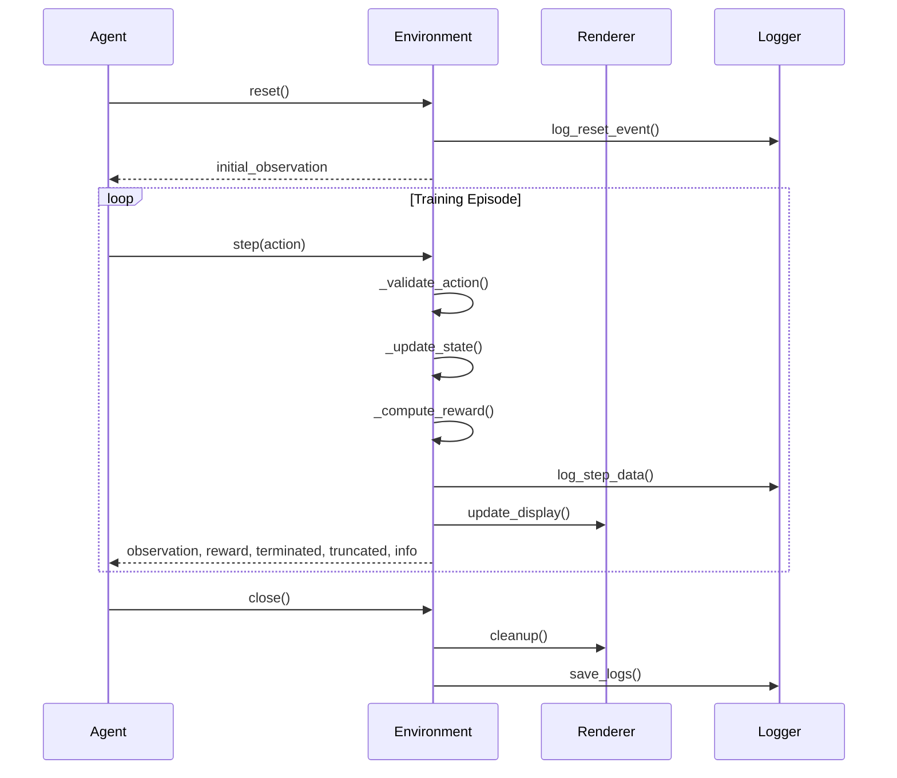
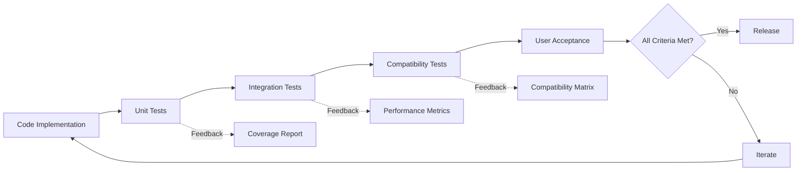

# Feature Idea: Custom Reinforcement Learning Environment Framework

## Overview

A flexible, extensible framework for creating custom reinforcement learning (RL) environments that follows OpenAI Gym/Gymnasium API standards. This framework will enable researchers and developers to rapidly prototype and test RL algorithms across various problem domains with consistent interfaces, built-in debugging tools, and comprehensive visualization capabilities.

## Problem Statement (Project Context)

### Business Problem: Support Ticket Routing for B2B SaaS

**Current Situation:**
A B2B SaaS company receives 50+ support tickets daily. Currently, tickets are randomly assigned to support agents, leading to:
- Long resolution times
- Inefficient resource utilization
- Customer dissatisfaction
- Agent burnout and frustration

**Core Challenge:**
Some agents have specialized expertise in specific problem types (e.g., billing issues, technical bugs, integration problems), but the random assignment system doesn't leverage these strengths. Additionally, agent workload and ticket priority levels are not considered in the routing decision.

**Proposed RL Solution:**
Build a reinforcement learning environment where an RL agent learns to intelligently route incoming support tickets to the best-suited support agent based on:
- **Ticket Type**: Technical, billing, feature request, bug report, etc.
- **Agent Expertise**: Historical performance on different ticket types
- **Current Workload**: Number of open tickets per agent
- **Priority Level**: Critical, high, medium, low

### Framework Development Challenges

Beyond the business problem, this project also addresses general RL environment development challenges:

1. **Inconsistent APIs**: Many custom environments lack standardization, making it difficult to swap environments or compare algorithm performance
2. **Limited Debugging Tools**: Developers struggle to debug agent behavior and environment interactions without proper visualization and logging
3. **Steep Learning Curve**: Creating new environments from scratch requires deep understanding of RL frameworks
4. **Poor Reproducibility**: Without proper state management and seeding, experiments become difficult to reproduce
5. **Integration Complexity**: Connecting custom environments with popular RL libraries (Stable Baselines3, RLlib, etc.) requires significant boilerplate code

## Proposed Solution

Develop a comprehensive RL environment framework that provides:

### Core Components

1. **Base Environment Classes**
   - Abstract base class implementing Gymnasium API
   - Common utilities for observation/action space handling
   - Automatic state validation and error checking
   - Built-in rendering capabilities

2. **Environment Templates**
   - Grid-world environments (maze solving, navigation)
   - Continuous control environments (robotic manipulation)
   - Game-based environments (card games, board games)
   - Multi-agent environments with competition/cooperation

3. **Debugging & Visualization Tools**
   - Real-time rendering with multiple backends (pygame, matplotlib, web-based)
   - Episode replay functionality
   - State/action trajectory logging
   - Reward shaping visualization

4. **Testing & Validation Suite**
   - Automated environment validation tests
   - Performance benchmarking tools
   - Compatibility checkers for RL libraries

## Expected Benefits (Project User Impact)

### For RL Researchers
- **Faster Prototyping**: Create new environments in hours instead of days
- **Better Reproducibility**: Built-in seeding and state management ensures consistent results
- **Easy Comparison**: Standardized API allows direct comparison across environments

### For RL Students & Educators
- **Lower Barrier to Entry**: Template-based approach simplifies learning
- **Interactive Learning**: Visual debugging tools help understand agent behavior
- **Real Examples**: Production-ready templates demonstrate best practices

### For RL Practitioners
- **Production Ready**: Robust error handling and validation
- **Library Agnostic**: Works seamlessly with Stable Baselines3, RLlib, CleanRL, etc.
- **Performance Optimized**: Efficient implementation for large-scale training

### Measurable Outcomes
- Reduce environment development time by 70%
- Achieve 100% Gymnasium API compatibility
- Support 5+ major RL libraries out of the box
- Provide 10+ production-ready environment templates

## Technical Considerations (Project Integration)

### Technology Stack

**Core Framework**
- Python 3.8+
- Gymnasium (OpenAI Gym successor)
- NumPy for numerical operations
- Type hints with mypy for type safety

**Visualization & Rendering**
- Pygame for real-time 2D rendering
- Matplotlib for plotting and analysis
- Optional: Three.js for web-based 3D visualization

**Testing & Quality**
- pytest for unit and integration tests
- hypothesis for property-based testing
- black/ruff for code formatting
- pre-commit hooks for code quality

**Documentation**
- Sphinx for API documentation
- MkDocs for user guides
- Jupyter notebooks for tutorials

### Architecture Patterns

1. **Strategy Pattern**: Pluggable reward functions and observation processors
2. **Template Method Pattern**: Base environment class with customizable hooks
3. **Observer Pattern**: Event system for debugging and logging
4. **Factory Pattern**: Environment registry for easy instantiation

### Performance Considerations

- Vectorized operations using NumPy for batch processing
- Optional GPU acceleration for observation rendering
- Memory-efficient state representation
- Configurable simulation speed (step vs. real-time)

### Data Modeling

## Project System Integration

### Component Interactions

### Integration Points

1. **RL Library Integration**
   - Gymnasium-compliant API ensures compatibility
   - Wrapper utilities for library-specific requirements
   - Vectorized environment support for parallel training

2. **Data Pipeline**
   - Episode data export to HDF5/Parquet for analysis
   - Integration with TensorBoard for metrics
   - Optional MLflow integration for experiment tracking

3. **Rendering System**
   - Modular rendering backends (headless, pygame, matplotlib, web)
   - Screen capture for video generation
   - Real-time plotting of metrics

4. **Configuration Management**
   - YAML/JSON configuration files
   - Hydra integration for hierarchical configs
   - Environment versioning and registry

## Initial Scope

### Phase 1: Core Framework (MVP)
- [ ] Base environment class with Gymnasium API
- [ ] Input validation and error handling
- [ ] Basic state management and seeding
- [ ] Simple grid-world template
- [ ] Pygame-based renderer
- [ ] Unit test suite
- [ ] Basic documentation

### Phase 2: Enhanced Features
- [ ] Additional environment templates (3-5 examples)
- [ ] Matplotlib visualization tools
- [ ] Episode replay functionality
- [ ] Reward shaping utilities
- [ ] Integration tests with Stable Baselines3
- [ ] Comprehensive API documentation

### Phase 3: Advanced Capabilities
- [ ] Multi-agent environment support
- [ ] Web-based visualization dashboard
- [ ] Performance optimization
- [ ] Experiment tracking integration
- [ ] Tutorial notebooks
- [ ] Benchmark suite

### Out of Initial Scope
- Advanced 3D physics simulation (use existing engines)
- Distributed training infrastructure (use RL libraries)
- Pre-trained agents (focus on environments)
- Custom RL algorithms (environment-agnostic)

## Success Criteria

### Technical Metrics
1. **API Compliance**: 100% compatibility with Gymnasium API specification
2. **Test Coverage**: Minimum 90% code coverage
3. **Performance**: Environment step time < 1ms for simple environments
4. **Compatibility**: Verified integration with 5+ RL libraries

### User Experience Metrics
1. **Ease of Use**: New environment creation in < 50 lines of code
2. **Documentation**: Complete API docs + 5+ tutorial examples
3. **Reliability**: Zero critical bugs in core functionality
4. **Debugging**: Visual debugging reduces troubleshooting time by 50%

### Quality Gates
- All tests passing (unit, integration, compatibility)
- Type checking passes with mypy (strict mode)
- Code formatting with black/ruff
- Documentation builds without warnings
- Example environments run successfully

### Validation Approach

### Acceptance Criteria

**Must Have**
- Environment follows Gymnasium API exactly
- All core methods (reset, step, render, close) implemented
- Deterministic behavior with seed control
- Clear error messages for invalid inputs
- Works with at least Stable Baselines3

**Should Have**
- Visual debugging tools functional
- 3+ working environment templates
- Documentation with code examples
- Performance benchmarks available

**Nice to Have**
- Web-based visualization
- Multi-agent support
- Advanced reward shaping tools
- Video recording utilities

---

## Next Steps

1. **Project Setup**: Initialize Python project with modern tooling (poetry/pip-tools)
2. **Core Implementation**: Develop base environment class following TDD methodology
3. **Template Creation**: Build first grid-world environment as reference
4. **Testing Framework**: Establish comprehensive test suite
5. **Documentation**: Create getting-started guide and API reference
6. **Community Feedback**: Share with RL community for early validation

## References

- [Gymnasium Documentation](https://gymnasium.farama.org/)
- [PettingZoo Multi-Agent Environments](https://pettingzoo.farama.org/)
- [Stable Baselines3 Custom Environments](https://stable-baselines3.readthedocs.io/en/master/guide/custom_env.html)
- [RL Environment Design Best Practices](https://arxiv.org/abs/1709.06560)
