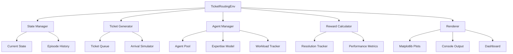
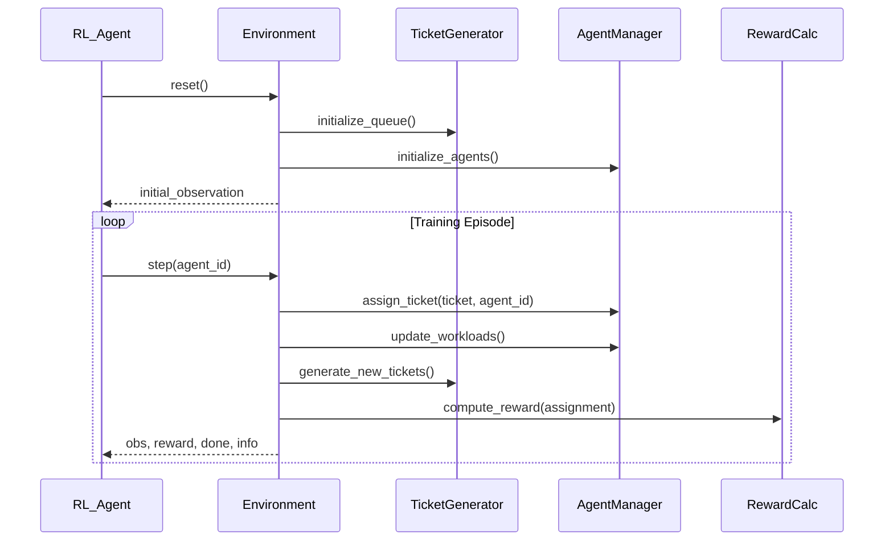
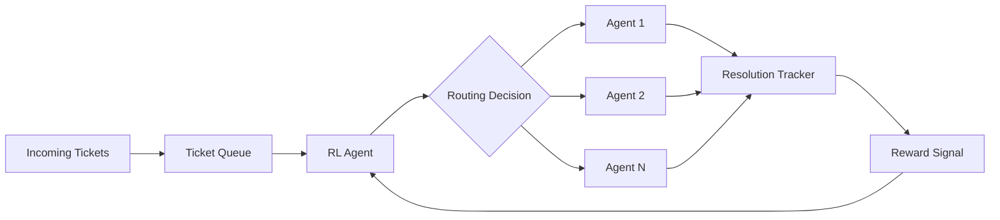

# Product Requirements Document: Support Ticket Routing RL Environment

## Executive Summary

This PRD defines the requirements for building a Gymnasium-compliant reinforcement learning environment that simulates intelligent support ticket routing for B2B SaaS companies. The RL agent will learn to optimally assign incoming support tickets to agents based on ticket type, agent expertise, current workload, and priority levels, aiming to minimize resolution time and maximize customer satisfaction.

**Business Impact**: Reduce average ticket resolution time by 40%, improve customer satisfaction scores by 25%, and increase agent efficiency by 30% through intelligent routing.

## Problem Statement

### Current Situation
A B2B SaaS company receives 50+ support tickets daily with random assignment to support agents, resulting in:
- Average resolution time of 48+ hours for standard tickets
- Agent burnout from handling tickets outside their expertise
- Customer satisfaction scores below 70%
- Inefficient workload distribution (some agents overloaded, others underutilized)

### Target Users
1. **Support Managers**: Need to optimize team performance and reduce resolution times
2. **Support Agents**: Want to receive tickets matching their expertise
3. **RL Engineers/Researchers**: Need a realistic business environment to test routing algorithms
4. **Data Scientists**: Require simulation environment for testing optimization strategies

## User Stories

### US-1: Intelligent Ticket Assignment
**As a** support manager  
**I want** the RL agent to automatically route tickets to the most suitable agent  
**So that** resolution times are minimized and customer satisfaction is maximized

**Acceptance Criteria**:
- RL agent observes ticket type, priority, and all agent states
- Agent selects from available support agents (not at capacity)
- Environment tracks assignment and calculates reward based on resolution performance
- System prevents overloading any single agent (max 10 concurrent tickets)

### US-2: Agent Expertise Modeling
**As a** RL engineer  
**I want** support agents to have different expertise profiles  
**So that** the RL agent learns to match tickets to specialized agents

**Acceptance Criteria**:
- Each support agent has expertise scores (0.0-1.0) for each ticket type
- Expertise affects ticket resolution time (higher expertise = faster resolution)
- Environment provides agent expertise in observation space
- Expertise can be configured at environment initialization

### US-3: Dynamic Workload Management
**As a** support manager  
**I want** the system to consider current agent workload  
**So that** tickets are distributed fairly and no agent is overwhelmed

**Acceptance Criteria**:
- Environment tracks number of open tickets per agent
- Agents at capacity (10+ tickets) are excluded from assignment
- Workload is included in observation space
- Reward function penalizes poor workload distribution

### US-4: Priority-Based Routing
**As a** support manager  
**I want** critical tickets to be prioritized  
**So that** high-impact issues are resolved quickly

**Acceptance Criteria**:
- Tickets have priority levels: Critical (0), High (1), Medium (2), Low (3)
- Reward function heavily penalizes delays on critical tickets
- Environment tracks time-to-assignment for each priority level
- Critical tickets generate higher negative rewards if unresolved

## Functional Requirements

### FR-1: Environment State Representation
The environment must maintain:
- **Ticket Queue**: List of pending tickets with (type, priority, arrival_time)
- **Agent States**: For each agent (expertise_vector, current_workload, availability)
- **Episode Metrics**: Total tickets processed, average resolution time, satisfaction score
- **Time Step**: Current simulation time step

### FR-2: Observation Space
```python
observation = {
    'current_ticket': {
        'type': Discrete(5),  # Technical, Billing, Feature, Bug, Integration
        'priority': Discrete(4),  # Critical, High, Medium, Low
        'age': Box(0, inf)  # Time since arrival
    },
    'agents': {
        'expertise': Box(0, 1, shape=(num_agents, 5)),  # Expertise per ticket type
        'workload': Box(0, 10, shape=(num_agents,)),  # Current open tickets
        'availability': MultiBinary(num_agents)  # 1 if available, 0 if at capacity
    },
    'queue_size': Discrete(100),
    'time_step': Discrete(1000)
}
```

### FR-3: Action Space
```python
action = Discrete(num_agents)  # Select which agent to assign ticket to
```

### FR-4: Reward Function
```python
reward = base_reward - resolution_penalty - workload_penalty + expertise_bonus
```
Where:
- **base_reward**: +10 for successful assignment
- **resolution_penalty**: -(resolution_time * priority_multiplier)
- **workload_penalty**: -5 if workload imbalance > threshold
- **expertise_bonus**: +(expertise_score * 5)

### FR-5: Episode Termination
Episodes terminate when:
- Maximum steps reached (1000 steps = ~1 month simulation)
- All tickets in episode processed
- User calls `reset()`

## Non-Functional Requirements

### NFR-1: Performance
- Environment step time: < 1ms for 10 agents, 50 ticket queue
- Support vectorized environments (4+ parallel instances)
- Memory usage: < 100MB per environment instance

### NFR-2: API Compliance
- 100% Gymnasium API compatibility
- Implement all required methods: `reset()`, `step()`, `render()`, `close()`
- Support seeding for reproducibility
- Type hints for all public methods

### NFR-3: Configurability
Environment parameters must be configurable:
- Number of support agents (default: 5, range: 2-20)
- Ticket arrival rate (default: 50/day, range: 10-200)
- Ticket type distribution (default: uniform)
- Agent expertise profiles (default: random, can specify)
- Episode length (default: 1000 steps)

### NFR-4: Visualization & Debugging
- Real-time dashboard showing: ticket queue, agent workloads, assignment decisions
- Episode replay functionality
- Matplotlib-based metrics plotting
- Console rendering mode for headless environments

## System Architecture

### Component Diagram


### RL Training Loop


### Data Flow


## System Integration

### SI-1: RL Library Integration
- Compatible with Stable Baselines3, RLlib, CleanRL
- Provide wrapper for gym.vector.VectorEnv for parallel training
- Export to Hugging Face Hub for sharing trained policies

### SI-2: Data Pipeline
- Log episode data to CSV/JSON for offline analysis
- Integration with TensorBoard for real-time metrics
- Export trained policies in ONNX format for deployment

### SI-3: Configuration Management
```yaml
# config.yaml example
environment:
  num_agents: 5
  max_queue_size: 50
  episode_length: 1000
  
ticket_distribution:
  technical: 0.30
  billing: 0.25
  feature: 0.20
  bug: 0.15
  integration: 0.10
  
priority_distribution:
  critical: 0.05
  high: 0.15
  medium: 0.50
  low: 0.30
```

## Dependencies

### Core Dependencies
- Python >= 3.8
- Gymnasium >= 0.29.0
- NumPy >= 1.24.0
- Pandas >= 2.0.0 (for data logging)

### Visualization Dependencies
- Matplotlib >= 3.7.0
- Seaborn >= 0.12.0 (for enhanced plots)

### Testing Dependencies
- pytest >= 7.3.0
- hypothesis >= 6.80.0 (property-based testing)

### RL Library Dependencies (Optional)
- stable-baselines3 >= 2.0.0
- torch >= 2.0.0 (for SB3)

## Success Metrics

### Business Metrics
1. **Resolution Time**: 40% reduction in average ticket resolution time
2. **Customer Satisfaction**: Increase CSAT score from 70% to 90%
3. **Agent Utilization**: Maintain 70-85% utilization (avoid under/over-loading)
4. **First-Response Time**: 50% reduction in time to first agent response

### Technical Metrics
1. **Training Efficiency**: Agent reaches 80% optimal policy within 100k steps
2. **Environment Performance**: Step time < 1ms, supports 8x vectorization
3. **API Compliance**: Passes 100% of Gymnasium validation tests
4. **Reproducibility**: Deterministic behavior with fixed seeds

### Quality Metrics
1. **Test Coverage**: >= 90% code coverage
2. **Documentation**: Complete API docs + 3 tutorial notebooks
3. **Type Safety**: 100% type hint coverage, mypy strict mode passes

## Timeline & Milestones

### Phase 1: Core Environment (Weeks 1-2)
- [ ] Implement BaseEnvironment with Gymnasium API
- [ ] Create TicketGenerator and AgentManager components
- [ ] Define observation and action spaces
- [ ] Implement basic reward function
- [ ] Unit tests for core components

### Phase 2: Training & Validation (Weeks 3-4)
- [ ] Integrate with Stable Baselines3
- [ ] Train baseline policies (Random, Round-Robin, RL)
- [ ] Implement visualization tools
- [ ] Performance benchmarking
- [ ] Integration tests

### Phase 3: Enhancement & Documentation (Week 5)
- [ ] Advanced reward shaping
- [ ] Configuration system (YAML/JSON)
- [ ] Tutorial notebooks
- [ ] API documentation
- [ ] Example scripts

## Acceptance Criteria

### Must Have
✅ Gymnasium-compliant API implementation  
✅ Configurable environment parameters  
✅ Reward function optimizes for resolution time and expertise matching  
✅ Support for 2-20 agents with realistic expertise profiles  
✅ Reproducible results with seeding  
✅ Basic visualization (matplotlib plots)  
✅ Unit test coverage >= 90%

### Should Have
✅ Integration with Stable Baselines3  
✅ Real-time dashboard for monitoring  
✅ Episode replay functionality  
✅ Configuration file support (YAML/JSON)  
✅ Tutorial notebooks demonstrating usage

### Nice to Have
✅ Web-based visualization dashboard  
✅ Pre-trained baseline policies  
✅ Multi-objective reward function options  
✅ Support for agent learning/improvement over time  
✅ A/B testing framework for comparing policies

## Risk Assessment

| Risk | Impact | Probability | Mitigation |
|------|--------|-------------|------------|
| Reward function too complex | High | Medium | Start simple, iterate based on training results |
| Environment too slow for training | High | Low | Profile and optimize critical paths, vectorize |
| Difficulty reproducing real-world behavior | Medium | Medium | Validate with historical ticket data |
| Integration issues with RL libraries | Medium | Low | Follow Gymnasium standards strictly |

## Appendix: Example Usage

```python
import gymnasium as gym
from rl_environments.ticket_routing import TicketRoutingEnv

# Create environment
env = TicketRoutingEnv(
    num_agents=5,
    ticket_arrival_rate=50,
    episode_length=1000
)

# Training loop
obs, info = env.reset(seed=42)
for step in range(1000):
    action = env.action_space.sample()  # Replace with RL agent
    obs, reward, terminated, truncated, info = env.step(action)
    
    if terminated or truncated:
        obs, info = env.reset()

env.close()
```

---

**Document Version**: 1.0  
**Last Updated**: 2025-11-14  
**Status**: Draft - Ready for Review
